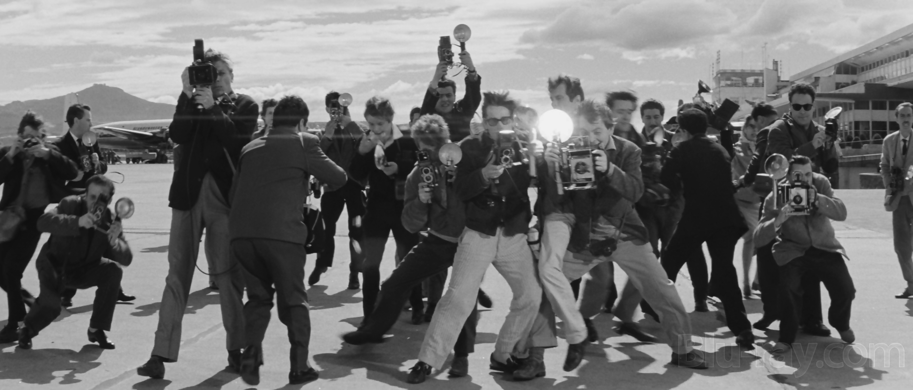

# Tangram Paparazzi

Sneaky version of [Tangram-ES](https://github.com/tangrams/tangram-es) to take snapshots of Tangram using a RaspberryPi.


## Install

Compile `tangramPaparazzi`:

```bash
git clone --recursive https://github.com/tangrams/paparazzi.git
cd paparazzi
./install.sh
cd build
make
```

## Use `paparazzi` binnary

You can use the paparazzi binnary (`build/bin/./paparazzi`) with the following arguments. It will return an image of the specify YAML scene file at the given position, zoom, tilt and rotation.

| Argument       | Description                                |
|----------------|--------------------------------------------|
| `-s file.yaml` | Mandatory. Specify the YAML scene file |
| `-o image.png` | Mandatory. Output image file |
| `-w [number]`  | Width of the final image |
| `-h [number]`  | Height of the final image |
| `-lat [LAT]`	 | Latitud	  |
| `-lot [LON]`   | Longitud |
| `-z [zoom]`    | Zoom Level |
| `-t [tilt]`    | Tilt degree of the camera |
| `-r [rot]`     | Rotation degree of the map |

## Use paparazzi Node.js `server.js`

The Node.js `server.js` set a HTTP server that listen for calls and use the query calls to the URL path as arguments to construct a picture of a map using `paparazzi` binnary.

To run the server simply do:

```bash
cd paparazzi
npm start
```

Then on a browser do something like

```
http://server.local:8080/?zoom=17&lat=40.7086&lon=-73.9924&scene=https://dl.dropboxusercontent.com/u/335522/openframe/tangram/blueprint.yaml
```

Here is a list of arguments to pass to the URL

| Query Arguments   | Description                                |
|-------------------|--------------------------------------------|
| `scene=[url]`     | Specify a valid url to the YAML scene file |
| `width=[number]`  | Width of the final image |
| `heigth=[number]` | Height of the final image |
| `lat=[LAT]`       | Latitud    |
| `lot=[LON]`       | Longitud |
| `zoom=[zoom]`     | Zoom Level |
| `tilt=[tilt deg]` | Tilt degree of the camera |
| `rot=[rot deg]`   | Rotation degree of the map |

